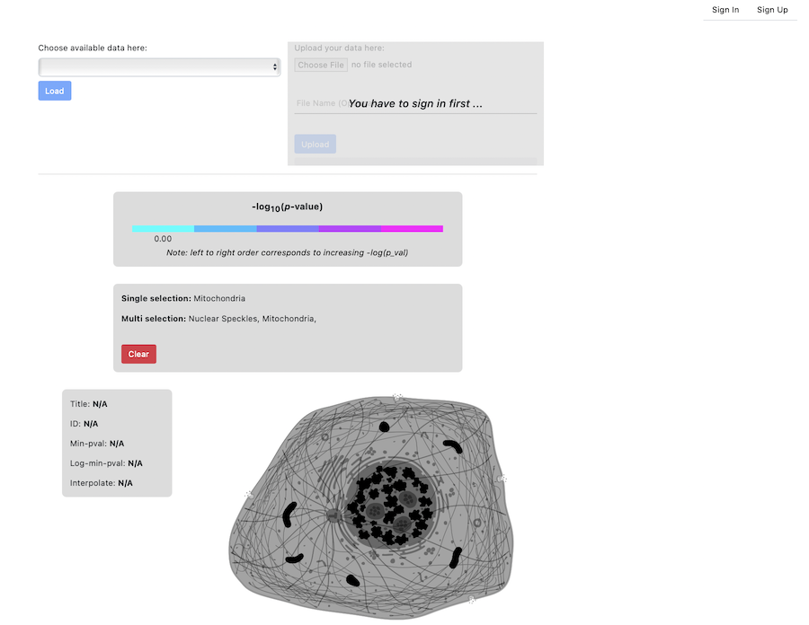

# Advaita Cell Visualizer Companion App

Link to app: https://advaita-cell-visualizer.web.app

## Background
Worked with Tim Huynh (Github @TimHuynh0905) as a team of 2.

Frontend Code: https://github.com/TimHuynh0905/cell_visualizer

Backend Code: https://github.com/TimHuynh0905/cell_visualizer_backend

## Overview:
- This application is meant to used by bioinformatics to visualize the impact factors (a.k.a significance) of various cell components based on disease (phenotype) microarray data based on any disease. Broadly speaking, the magnitude of each component's impact factor indicates how much that component is underrepresented/overrepresented for each phenotype. For example, if Mitochondria has a high impact factor in a melanoma phenotype, then Mitochondria is overrepresented in melanoma compared to a control phenotype. More information on impact factor can be found in Chapter 28 of *Statistics and Data Analysis for Microarrays Using R and Bioconductor 2nd Ed.* by Sorin Draghici.

## Instructions:
- Access [Advaita's iPathway Guide](https://advaitabio.com/ipathwayguide/) and register for a free account
- Upload your csv file of microarray data to the iPathwayGuide. Follow iPathwayGuide's specifications for this data.
- iPathwayGuide will output another csv file formatted with a p-value corresponding to each cell component. Here is the format of the output data:

|   | Gene Ontology ID | Gene Ontology Name | Differentially Expressed Gene Count | Total Expressed Gene Count | Component P-value|
|----|-----------------|--------------------|-------------------------------------|----------------------------|----------------------------|
|Component 1|          |                    |                                     |                            |                            |
|Component 2|          |                    |                                     |                            |                            |

- Create an account on https://advaita-cell-visualizer.web.app

- Upload your iPathwayGuide output csv file to the cell visualizer companion app
